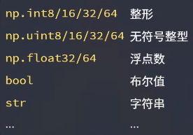
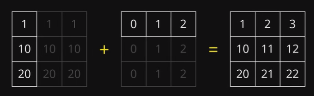

# numpy的基本使用


## 一、NumPy 的主要特性和功能：

1. **多维数组对象（ndarray）**：
   - NumPy 的核心是 ndarray 对象，它是一个多维数组，可以存储相同类型的元素。ndarray 对象具有固定大小，支持矢量化运算和广播功能，这使得在 NumPy 中进行数组运算非常高效。
2. **数组创建**：
   - 可以通过多种方式创建 ndarray 对象，包括从 Python 列表或元组转换、使用 NumPy 提供的函数生成特定形状和数据类型的数组、从文件读取数据等。
3. **数组操作**：
   - **索引与切片**：与 Python 列表类似，可以使用索引和切片来访问和修改数组的元素。
   - **数组形状操作**：可以改变数组的形状，如重塑、扁平化、转置等。
   - **数组组合与分割**：可以将多个数组组合成一个新数组，或者将一个数组分割成多个子数组。
   - **数组的计算**：NumPy 提供了丰富的数学和统计函数，如加减乘除、三角函数、指数函数、对数函数、统计函数等，可以对数组进行各种数学和统计计算。
4. **数组广播**：
   - 当进行不同形状数组之间的运算时，NumPy 使用广播规则来进行计算，这使得在不同维度的数组之间进行运算变得更加方便和高效。
5. **线性代数运算**：
   - NumPy 提供了丰富的线性代数运算功能，如矩阵乘法、矩阵分解、求解线性方程组等，可以方便地进行各种线性代数计算。
6. **随机数生成**：
   - NumPy 提供了生成各种概率分布的随机数的函数，如均匀分布、正态分布、泊松分布等，这对于模拟和概率计算非常有用。
7. **文件输入输出**：
   - NumPy 支持从文本文件、二进制文件以及 NumPy 自定义的文件格式中读取数据，也可以将数据保存到这些格式中。
8. **性能优化**：
   - NumPy 中的许多操作都是使用 C 语言实现的，因此具有很高的性能。此外，NumPy 还提供了一些优化工具，如向量化操作、内存优化等，可以进一步提高计算效率。


## 二、Numpy 对数组进行操作

###### 1.导入numpy数据库

```python
import numpy as np
```

###### 2.创建数组

```python
print(np.array([1, 2, 3, 4, 5]))
```

###### 3.创建全零数组或全一数组

```python
# 0
print(np.zeros((3, 2)))
# 1
print(np.ones((2, 4)))

"""
[[0. 0.]
 [0. 0.]
 [0. 0.]]
[[1. 1. 1. 1.]
 [1. 1. 1. 1.]]
"""
```

###### 4.获取数组的尺寸

```python
a = np.zeros((3, 2))
print(a.shape)  # （行，列）
# (3, 2)
```

###### 5.创建递增或递减的数组,类似range

```python
print(np.arange(3, 7)) # [3 4 5 6]
```

###### 6.介于两个数之间，等间距的数

```python
print(np.linspace(0, 1, 5))
# [0.   0.25 0.5  0.75 1.  ]
```

###### 7.生成随机数组

```python
print(np.random.rand(2, 4))
# [[0.4270443  0.38154075 0.46158911 0.11078224]
# [0.67902116 0.58708575 0.85713226 0.43969598]]
```

###### 8.数组的数据类型

```python
a = np.zeros((3, 2))
print(a.dtype)
# float64
```



###### 9.指定数组的数据类型

```python
a = np.zeros((3, 2), dtype=np.int32)
print(a.dtype)
# int32
```

###### 10.转换数据类型

```python
a = np.zeros((3, 2))
b = a.astype(int)
print(b.dtype)
# int32
```


## 三、Numpy 的基本运算

###### 1.四则运算,将数组同位置的元素进行 加减乘除

```python
a = np.array([1, 2, 3])
b = np.array([4, 5, 6])

print(a + b) # [5 7 9]
print(a / b) # [0.25 0.4  0.5 ]
```

###### 2.将两个向量进行点乘运算

```python
print(np.dot(a, b)) # 32
```

###### 3.矩阵乘法运算

```python
a = np.array([[1, 2], [3, 4]])
b = np.array([[4, 5], [7, 8]])
print(a @ b)
print(np.matmul(a, b))
"""
[[18 21]
 [40 47]]
[[18 21]
 [40 47]]
"""
```

###### 4.求平方根

```python
a = np.array([1, 2, 3])
print(np.sqrt(a)) # [1.         1.41421356 1.73205081]
```

###### 5.三角函数运算

```python
a = np.array([1, 2, 3])
print(np.sin(a)) # [0.84147098 0.90929743 0.14112001]
print(np.cos(a)) # [ 0.54030231 -0.41614684 -0.9899925 ]
```

###### 6.对数与指数运算

```python
a = np.array([1, 2, 3])
print(np.log(a)) # [0.         0.69314718 1.09861229]
print(np.power(a, 2)) # [1 4 9]
```

###### 7.广播

```python
a = np.array([1, 2, 3])
print(a * 5) # [ 5 10 15]
```

###### 8.不同尺寸的数组之间的运算

```python
a = np.array([[1], [10], [20]])
b = np.array([4, 5, 6])
print(a + b)
"""
[[ 5  6  7]
 [14 15 16]
 [24 25 26]]
"""
```



###### 9.获取最大最小值的数与索引

```python
a = np.array([1, 2, 3, 4, 5])
print(a.min()) # 1
print(a.max()) # 5

print(a.argmin()) # 0
print(a.argmax()) # 4
```

###### 10.求和，平均值，中位数，方差，标准方差

```python
# 一维数组
a = np.array([1, 2, 3, 4, 5])
print(a.sum()) # 15
print(a.mean()) # 3.0
print(np.median(a)) # 3.0
print(a.var()) # 2.0
print(a.std()) # 1.4142135623730951

# 多维数组
a = np.array([[1, 2, 3, 4, 5],
              [5, 6, 7, 8, 9]])
print(a.sum(axis=0))  # 每一列中对应的数相加
# [ 6  8 10 12 14]
print(a.sum(axis=1))  # 每一行中对应的数相加
# [15 35]
```

###### 11.获取数组中的元素

```python
a = np.array([[1, 2, 3, 4, 5],
              [5, 6, 7, 8, 9]])

print(a[0, 1])  # 第一行第二列 # 2
# 切片
print(a[0, 0:2]) # [1 2]
print(a[0, :]) # [1 2 3 4 5]
# 步长
a = np.array([1, 2, 3, 4, 5, 6, 7, 8, 9])
print(a[0:9:2]) # [1 3 5 7 9]
print(a[0:9:3]) # [1 4 7]
print(a[4:1:-2]) # 反转
# [5 3]
```

###### 12.筛选指定的元素

```python
a = np.arange(10)
print(a) # [0 1 2 3 4 5 6 7 8 9]
print(a[a < 3]) # [0 1 2]
print(a[(a > 3) & (a % 2 == 0)]) # [4 6 8]
```


## 四、numpy 的使用

###### 1.导入库

```python
from PIL import Image
import numpy as np
```

###### 2.导入图片

```
im = Image.open('头像.jpg')
im.show()
```


###### 3.将图片转化为数组

```python
im = np.array(im)
print(im.shape) # (512, 512, 3)
```

###### 4.访问像素点颜色

```python
print(im[100, 100]) # [211 223 223]
```

###### 5.提取红色分量

```python
im_r = im[:, :, 0]
Image.fromarray(im_r).show()
```


###### 6.将图片按比例混合

```python
im1 = np.array(Image.open('4.jpg'))
im2 = np.array(Image.open('5.jpg'))
im_blend = im1 * 0.4 + im2 * 0.6
im_blend = im_blend.astype(np.uint8)
Image.fromarray(im_blend).show()
```


###### 7.反转图片

```python
im_flipped = im[::-1,:,:]
Image.fromarray(im_flipped).show()
```


###### 8.裁剪图片

```python
im_cropped = im1[40:540,400:900,:]
Image.fromarray(im_cropped).show()
```

